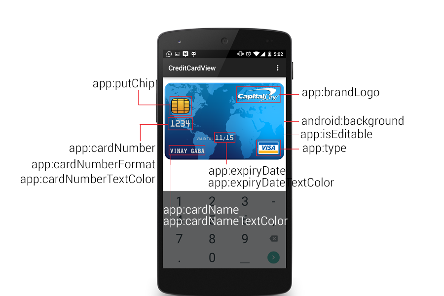
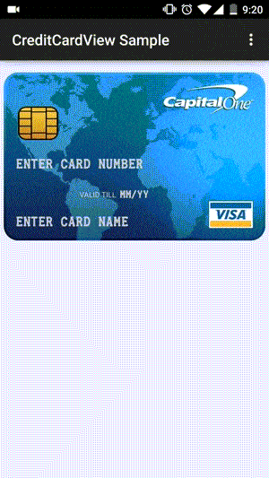
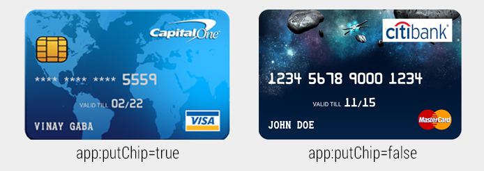

CreditCard View  [](https://maven-badges.herokuapp.com/maven-central/com.vinaygaba/creditcardview) [](http://android-arsenal.com/details/1/2005)
==================


CreditCardView is an Android library that allows developers to create the UI which replicates an actual Credit Card.

Displaying and entering the credit card details inside the app has become a very common use case seen in a lot of different apps, but it is often represented in a not so intuitive manner. With Android Pay being announced at the recent Google I/O 2015, more apps would require users to input their credit card details. I created this library with the aim of making the process of displaying and entering the credit card details more visually appealing to the users of your app.

Screenshots
------------


Features
---------

* Pre-built card backgrounds to help you get started quickly
* Fully Customizable
* Auto selection of drawables based on the credit card number pattern i.e. Visa, Mastercard,American Express & Discover. Will be adding more soon based on the requests I get
* Auto selection of logo drawable based on the credit card type i.e. Visa, Mastercard and American Express
* Editable and non-editable mode
* 4 different card number formats 


Setup
------
The library is pushed to Maven Central as an AAR, so you just need to add the following to your build.gradle file:
```java
dependencies {
    compile ‘com.vinaygaba:creditcardview:1.0.4’
}
```

Usage
------
Using CreditCardView is extremely easy, this is how you would declare it in the layout xml:
```java
<!-- Use <com.example.vinay.library.CreditCardView/> if you are using v1.0.1 of the library-->

<com.vinaygaba.creditcardview.CreditCardView
        android:id="@+id/card1"
        android:layout_width="fill_parent"
        android:layout_height="225dp"
        android:background="@drawable/cardbackground_world"
        android:layout_marginBottom="16dp"
        android:layout_marginTop="16dp"
        app:cardNumber="5500005555555559"
        app:cardName="Vinay Gaba"
        app:cardNumberTextColor="#cccccc"
        app:cardNumberFormat="masked_all_but_last_four"
        app:cardNameTextColor="#cccccc"
        app:type="auto"
        app:brandLogo="@drawable/brandlogo"
        app:putChip="true"
        app:expiryDate = "02/22"
        app:expiryDateTextColor="#cccccc"
        app:isEditable="true"
        app:validTillTextColor="#cccccc"
        app:hintTextColor = "#cccccc"
        />
```
Remember to put this for custom attribute usage:

```java

xmlns:app="http://schemas.android.com/apk/res-auto"

```
And this is how you would be adding it programatically in java:

```java
CreditCardView creditCardView= new CreditCardView(this);
```
OR

```java
CreditCardView creditCardView= (CreditCardView)findViewById(R.id.ID_OF_CARD);
```

Attribute Usage & Documentation
-----------------



##### I) `android:background`

Use this attribute to set the background of the card. This library includes 3 background by default which you can use, but **feel free to put any drawable and use it as the card background as you please**. If you do not want to use your own drawable and want to use the drawables available in the screenshots, do the following:

1)Sky Background


To use this background,simply use the line:
```
android:background = "@drawable/cardbackground_sky"
```

2)World Background


To use this background,simply use the following line:
```
android:background = "@drawable/cardbackground_world"
```
3) Plain Background


This is a customizable plain background where you can change the background color, radius and border color of the card. To use this, add the folowing line:
```
android:background = "@drawable/cardbackground_plain"
```

To customize the corner radius of the card, add the following attribute to your dimen.xml file with the attribute name "card_corner_radius":
```
<dimen name="card_corner_radius">size_in_dip</dimen>      //Default value is 10dip
```

To customize the background color and the border color of this card, add the following attributes to your color.xml file:
```
<color name="card_background">color_value</color>        //Default value is #e5e5e5
<color name="card_border">color_value</color>            //Default value is #ffffff
```
The important thing to note is that the name of these items should remain the same.

4)Custom Background

You can essentaially set any background you want as the card background.
You can set the value in xml using:
```
android:background="@drawable/drawable_name"
```

You can set the value of this attribute programmatically using:
```java
//Set Card Background
creditCardView.setBackgroundResource(R.drawable.drawable_name);
```

##### II) `app:isEditable`

Use this attribute if you want to make the card number, card name and the expiry date field editable to the user.



You can set the value in xml using:
```
app:isEditable="true/false"
```

You can set the value of this attribute programmatically using:
```java
//Set Is Editable Value
creditCardView.setIsEditable(true/false);

//Get Is Editable Value 
boolean isEditable= crediCardView.getIsEditable();
```
If you are using **v1.0.3 and above**, there are additional attributes that give you a more granular control over fields. They are: `app:isCardNumberEditable` , `app:isCardNameEditable` & `app:isExpiryDateEditable`

They have precedence over the isEditable attribute i.e. If these attributes are present, the respective fields will take their value over the value present in isEditable attribute

*Note: The card type auto detection and space after every 4 letters is added as soon as the focus is shifted from the edit field*


##### III) `app:cardNumber`

Use this attribute to set the card number of the card. 

You can set the value in xml using:
```
app:cardNumber="1234567890123456"
```

You can set and get the value of this attribute programmatically using:
```java
//Set Card Number
crediCardView.setCardNumber("1234567890123456");

//Get Card Number
String cardNumber = crediCardView.getCardNumber();
```

##### IV)  `app:cardNumberTextColor`

Use this attribute to set the text color of card number attribute. 

You can set the value in xml using:
```
app:cardNumberTextColor="#ffffff"
```

You can set and get the value of this attribute programmatically using:
```java
//Set Card Number Text Color
creditCardView.setCardNumberTextColor(Color.WHITE);

//Get Card Number Text Color
int color = crediCardView.getCardNumberTextColor();
```

##### V) `app:cardNumberFormat`

Use this attribute to set the card number format of card number. There are four different formats supported by the library:


1. all_digits - This will display all the numbers of the card number. 
2. masked_all_but_last_four - This will mask all the digits except the last four of the card number. 
3. only_last_four - This will display only the last four digits of the card number.
4. masked_all - This will mask all the digits of the card number. 

You can set the value in xml using:
```
app:cardNumberFormat="all_digits/masked_all_but_last_four/only_last_four/masked_all"    //Use any one format type
```

You can set and get the value of this attribute programmatically using:
```java
//Set Card Number Format. Chooose any one format
creditCardView.setCardNumberFormat(CardNumberFormat.ALL_DIGITS/CardNumberFormat.MASKED_ALL_BUT_LAST_FOUR/CardNumberFormat.ONLY_LAST_FOUR/CardNumberFormat.MASKED_ALL);

//Get Card Number Format
int cardFormat = crediCardView.getCardNumberFormat();
```
*Note: Default value is all_digits*

##### VI) `app:cardName`

Use this attribute to set the card name of the card. 

You can set the value in xml using:
```
app:cardName="John Doe"
```

You can set and get the value of this attribute programmatically using:
```java
//Set Card Name
crediCardView.setCardName("John Doe");

//Get Card Name
String cardName = crediCardView.getCardName();
```

##### VII) `app:cardNameTextColor`

Use this attribute to set the text color of card name attribute. 

You can set the value in xml using:
```
app:cardNameTextColor="#ffffff"
```

You can set and get the value of this attribute programmatically using:
```java
//Set Card Name Text Color
creditCardView.setCardNameTextColor(Color.WHITE);

//Get Card Name Text Color
int color = crediCardView.getCardNamerTextColor();
```

##### VIII) `app:expiryDate`

Use this attribute to set the expiry date of the card in MM/YY or MM/YYYY format. 

You can set the value in xml using:
```
app:expiryDate="01/15"
```

You can set and get the value of this attribute programmatically using:
```java
//Set Expiry Date
crediCardView.setExpiryDate("01/15");

//Get Card Number
String expiryDate = crediCardView.ExpiryDate();
```
##### IX) `app:expiryDateTextColor`

Use this attribute to set the text color of expiry date attribute. 

You can set the value in xml using:
```
app:expiryDateTextColor="#ffffff"
```

You can set and get the value of this attribute programmatically using:
```java
//Set Expiry Date Text Color
creditCardView.setExpiryDateTextColor(Color.WHITE);

//Get Expiry Date Text Color
int color = crediCardView.getExpiryDateTextColor();
```

##### X) `app:putChip`

Use this attribute if you want the card to display the chip on the card. 



You can set the value in xml using:
```
app:putChip="true/false"
```

You can set the value of this attribute programmatically using:
```java
//Set Put Chip Value
creditCardView.putChip(true/false);
```

##### XI) `app:type`

Use this attribute to set the type of the credit card. The library automatically places the corresponding drawable in the bottom right corner based on the type you have selected. Currectly there are 5 different types supported:

1. visa  
2. mastercard   
3. american_express   
4. discover   
5. auto - Use auto if u want the library to automatically choose the card type based on the card number you have entered. To know more about the patterns for identifying the card type from the card number, see this [link](http://www.regular-expressions.info/creditcard.html)

You can set the value in xml using:
```
app:type="visa/mastercard/american_express/discover/auto"
```

You can set the value of this attribute programmatically using:
```java
//Set Card Type.Choose any one card type from the following
creditCardView.setType(CardType.VISA/CardType.MASTERCARD/CardType.AMERICAN_EXPRESS/CardType.DISCOVER/CardType.AUTO);

//Get Card Type. 
int type = crediCardView.getType();
```

##### XII) `app:brandLogo`

Use this attribute to set the brand logo drawable that you see in the upper right corner. 

You can set the value in xml using:
```
app:brandLogo="@drawable/drawable_name"
```

You can set and get the value of this attribute programmatically using:
```java
//Set Brand Logo
crediCardView.setBrandLogo(R.drawable.drawable_name);
```

If you wish to modify the default dimensions of the brand logo, add the following attribute to your dimen.xml file:
```
<dimen name="brand_logo_width">size_in_dp</dimen>    //Default value is 120dp
<dimen name="brand_logo_height">size_in_dp</dimen>   //Default value is 40dp
```
The important thing to note is that the name of these items should remain the same.

##### XIII) `app:hintTextColor`

Use this attribute to set the hint text color that is visible when card name, card number and expiry date fields are editable and blank 

You can set the value in xml using:
```
app:hintTextColor="color_value"    //Default is White
```

You can set and get the value of this attribute programmatically using:
```java
//Set Hint Text Color
crediCardView.setHintTextColor(color_value);

//Get Hint Text Color
int color = crediCardView.geHintTextColor();
```

Additional Customizations
-----------------

My aim with this library was to cover as many use cases as possible and so I have tried to make it extremely customizable. There are some additional customizations possible like:

##### I) Modify String Resources

You can modify the hints which are displayed when the fields are empty and the card is editable. You can modify those by adding these attributes in the strings.xml file:

```
<string name="card_number_hint">hint</string>        //Default value: "ENTER CARD NUMBER"
<string name="expiry_date_hint">hint</string>        //Default value:"MM/YY"
<string name="card_name_hint">hint</string>          //Default value: "ENTER CARD NAME"
```
You can also modify some other additional string resources like:

```
<string name="valid_till">string</string>           //Default value: "VALID TILL"
```
The important thing to note is that the name of these items should remain the same. 
**Please make sure the string resources are in caps to be displayed correctly as the font does not support lower case**

##### II) Modify Dimensions

You can modify the dimensions of some of the attributes by adding these attributes to your dimens.xml file:

```
<dimen name="card_number_text_size">size</dimen>        //Default value:16sp
<dimen name="card_name_text_size">size</dimen>          //Default value:14sp
<dimen name="expiry_date_text_size">size</dimen>        //Default value:14sp
<dimen name="valid_till_text_size">size</dimen>         //Default value:10sp
<dimen name="brand_logo_width">size</dimen>             //Default value:120dp
<dimen name="brand_logo_height">size</dimen>            //Default value:40dp
```
The important thing to note is that the name of these items should remain the same.

Contributing
-----------------
Please use the issue tracker to report any bugs or file feature requests. There are a few features that I plan to work on based on the response the library gets, some of them being:

* Tablet Optimization. The current version is not optimized for tablets
* Landscape Optimization. The current version is not optimized for landscape mode
* Credit Card back view to display the CVV number
* Animations and touch callbacks
* Stack View to display multiple cards

I would love to get more people involved in the development of this library. A lot of times people are not sure about how they should be contributing to open source. If you are one of them, this is a great opportunity for you to get involved. You can also reach out to me for any queries that you might have about this library.

Credits
-----------------
Author: Vinay Gaba (vinaygaba@gmail.com)

<a href="https://plus.google.com/+Vinaygaba">
  
</a>
<a href="https://twitter.com/vinaygaba">
  
</a>
<a href="https://www.linkedin.com/in/vinaygaba">
  
</a>


License
-------

    Copyright 2015 Vinay Gaba

    Licensed under the Apache License, Version 2.0 (the "License");
    you may not use this file except in compliance with the License.
    You may obtain a copy of the License at

       http://www.apache.org/licenses/LICENSE-2.0

    Unless required by applicable law or agreed to in writing, software
    distributed under the License is distributed on an "AS IS" BASIS,
    WITHOUT WARRANTIES OR CONDITIONS OF ANY KIND, either express or implied.
    See the License for the specific language governing permissions and
    limitations under the License.
